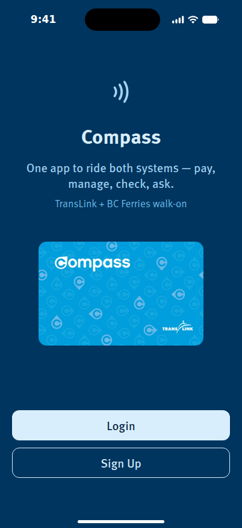
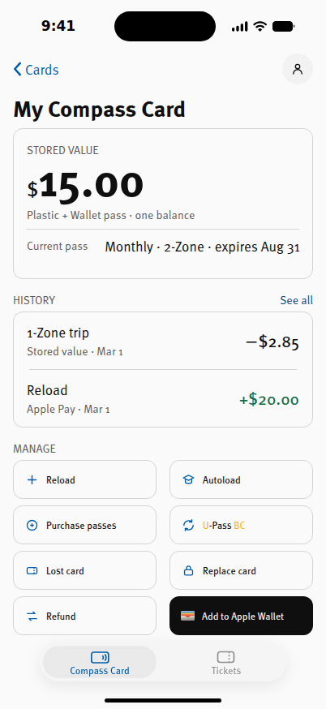
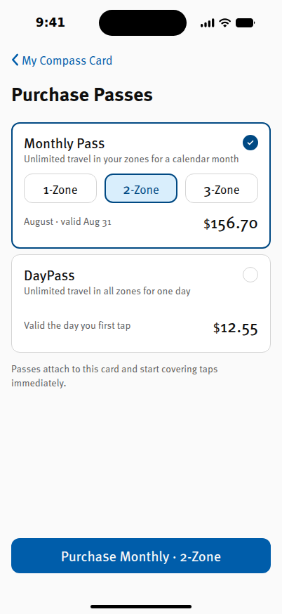

# Compass — concept demo

An interactive demo of a concept iOS app for the Compass Card, the fare card
for Metro Vancouver. It is a self-initiated design project and is **not
affiliated with or endorsed by TransLink or BC Ferries**.

The app runs at a fixed 402 × 874 — an iPhone screen — because it is shown
inside a phone frame on a case study rather than as a website. A larger
window centres it; a smaller one scales the whole screen down instead of
reflowing it, so the layout is always the one the design was drawn at.

| | | |
|---|---|---|
|  |  |  |

## What it does

Every screen works. An account earns its cards — signing up starts with
none, registering a plastic card imports its balance, pass and history,
buying a digital card creates one with the name and load typed onto it.
Reloading credits the ledger, passes land on the card and reprice by zone,
Autoload and the U-Pass school open real menus, a frozen card is declined
at the gate, and a refund closes the card it was asked about. The help
assistant answers from the same fare table the rest of the app reads.

Fares are TransLink's own, effective July 1 2026 — stored value, monthly
passes and DayPass by zone, concession rates, U-Pass BC, card fees and the
BC Ferries walk-on — all held in one table (`src/data/seed.js`) that every
screen and every answer reads from.

## Stack

- Vite + React (JavaScript), plain CSS on design tokens
- No router: navigation is a screen stack over two tabs, animated the way
  a navigation controller moves
- State is in memory only, so every visit starts from the same seeded data
- Installable: a web manifest and icons let a phone keep it on the home
  screen and open it full-bleed

## Running it

```bash
npm install
npm run dev      # http://localhost:5173
npm run build    # builds to dist/ with relative paths, so it can be served
                 # from any sub-path
```

## Testing it

The design is verified against the Figma frames by measurement, not by eye.

```bash
npm run build && npx vite preview   # serve the build on :4173, then
npm test                            # every screen against its Figma coordinates
npm run test:flows                  # the interactive layer, end to end
npm run test:sweep                  # every route, watching for errors
```

`tests/specs/*.json` hold the expected boxes per screen. The scripts drive
a real Chromium via Playwright; point `CHROME` at a binary if yours lives
somewhere unusual, and see `tests/env.cjs` for the optional font mirror.

## Payments

Every payment flow is fake. Nothing is charged, no card details are
collected, and each payment step says so on screen.

## Fonts

Type is FF Meta, loaded from an Adobe Fonts kit at runtime. The font files
are licensed and are not part of this repository; the kit has to list every
domain the demo is served from, or the app falls back to the system font.
